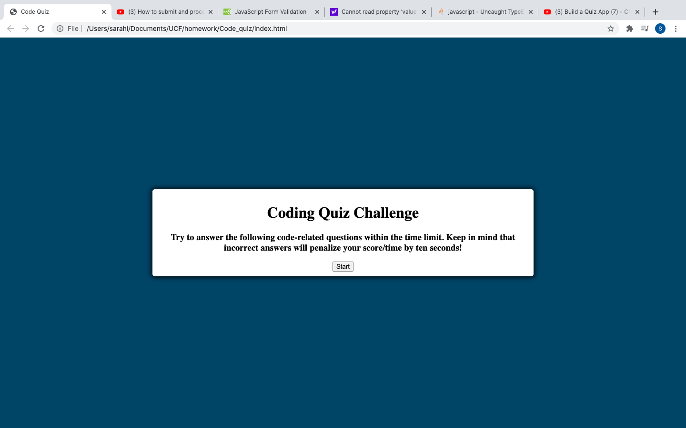
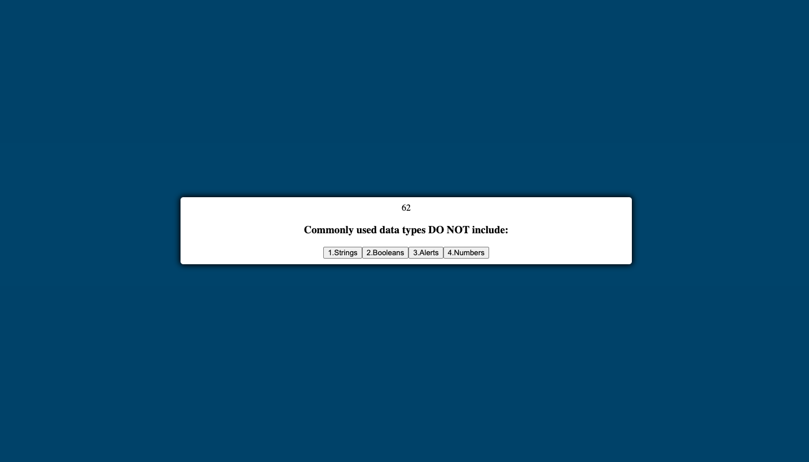
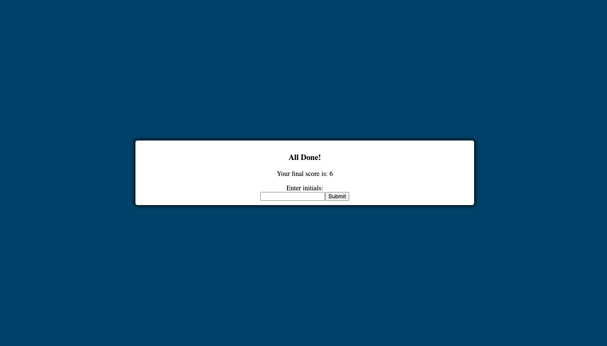

# Code_quiz

## Description 

This project is a multiple choice timed quiz game using javaScript. You should start off the game by reading the directions and clicking the start button. In doing so, you should be aware that the timer will start once you click the start button. You will be prompted with a series of questions and multiple choice answers. If you answer a question incorrectly the timer will deduct 10 seconds. Your final score is calculated by the time left on the timer. After, you will be able to submit your score to gauge your knowledge compared to your peers. 

## Installation

There are no installations required. This project will simply open in a browser window.

 https://irasar.github.io/Code_quiz/

## Usage 
 

## Credits

https://github.com/irasar
https://www.youtube.com/watch?v=LQGTb112N_c

## License

MIT License

Copyright (c) [2020] [Code_quiz]

Permission is hereby granted, free of charge, to any person obtaining a copy of this software and associated documentation files (the "Software"), to deal in the Software without restriction, including without limitation the rights to use, copy, modify, merge, publish, distribute, sublicense, and/or sell copies of the Software, and to permit persons to whom the Software is furnished to do so, subject to the following conditions:

The above copyright notice and this permission notice shall be included in all copies or substantial portions of the Software.

THE SOFTWARE IS PROVIDED "AS IS", WITHOUT WARRANTY OF ANY KIND, EXPRESS OR IMPLIED, INCLUDING BUT NOT LIMITED TO THE WARRANTIES OF MERCHANTABILITY, FITNESS FOR A PARTICULAR PURPOSE AND NONINFRINGEMENT. IN NO EVENT SHALL THE AUTHORS OR COPYRIGHT HOLDERS BE LIABLE FOR ANY CLAIM, DAMAGES OR OTHER LIABILITY, WHETHER IN AN ACTION OF CONTRACT, TORT OR OTHERWISE, ARISING FROM, OUT OF OR IN CONNECTION WITH THE SOFTWARE OR THE USE OR OTHER DEALINGS IN THE SOFTWARE.

## Built With

JavaScript 
HTML5 
CSS3 

